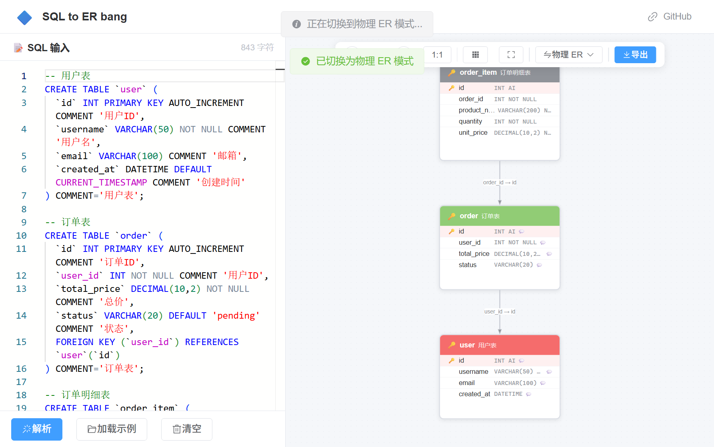
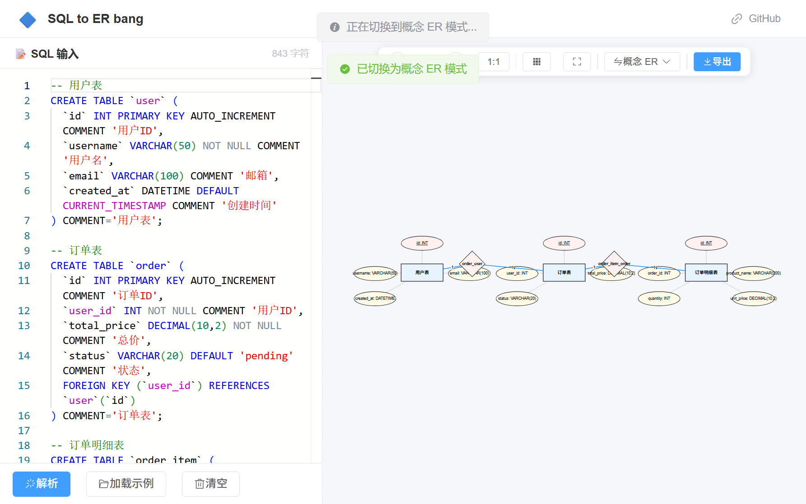

# 🔷 SQL to ER bang

> SQL 建表语句一键生成可拖拽编辑的 ER 图，支持物理 / 概念两种风格。

<p align="center">
  
  
  
  
</p>

<p align="center">
  <a href="http://20.205.45.177/" target="_blank">
    
  </a>
</p>

---

## ✨ 功能特性

### 核心功能

- 🔍 **SQL 一键解析** — 粘贴 `CREATE TABLE` 建表语句，自动提取表结构、字段、主键、外键、注释
- 🎨 **物理 ER 图** — DataGrip 风格，表节点含 PK/FK/注释徽章，外键连线带基数标注（1:N）
- 🧠 **概念 ER 图 (Chen 风格)** — 实体矩形 + 属性椭圆 + 关系菱形，一键切换模式
- ✏️ **拖拽编辑** — 拖拽节点调整位置，双击编辑文字，网格吸附对齐
- 🔍 **缩放平移** — 滚轮缩放（25%~400%），拖拽平移画布，一键适配窗口
- 📸 **导出图片** — 支持 PNG/JPEG 导出，透明背景可选
- 🧩 **自动布局** — Dagre 算法智能排列，避免节点重叠
- 📝 **多表批量解析** — 一次粘贴多条 `CREATE TABLE`，完整呈现数据库结构

### 支持数据库

| 数据库 | 支持情况 |
|--------|----------|
| MySQL | ✅ 完整支持 |
| PostgreSQL | ✅ 完整支持 |
| 其他（SQL标准） | 🟡 大部分支持 |

---

## 🖼️ 效果展示

### 物理 ER 图（DataGrip 风格）



### 概念 ER 图（Chen 风格）



---

## 🚀 快速开始

### 环境要求

- **后端**: JDK 17+
- **前端**: Node.js 18+
- **构建工具**: Maven（或使用项目自带的 Maven Wrapper）

### 本地运行

```bash
# 1. 克隆仓库
git clone https://github.com/bang12138/sql-to-er-bang.git
cd sql-to-er-bang

# 2. 启动后端
cd "SQL to ER bang-back"
./mvnw spring-boot:run

# 后端运行在 http://localhost:8080

# 3. 启动前端（新终端）
cd "SQL to ER bang-front"
npm install
npm run dev

# 前端运行在 http://localhost:5173
```

### 生产构建

```bash
# 后端打包
cd "SQL to ER bang-back"
./mvnw clean package -DskipTests
# 产物: target/SQLtoERbang-back-0.0.1-SNAPSHOT.jar

# 前端构建
cd "SQL to ER bang-front"
npm run build
# 产物: dist/
```

---

## 📡 API 接口

| 端点 | 方法 | 说明 |
|------|------|------|
| `/api/parse` | POST | 解析 SQL 建表语句 |
| `/api/example` | GET | 获取示例 SQL |
| `/api/health` | GET | 健康检查 |

### 解析请求示例

```json
// POST /api/parse
{
  "sql": "CREATE TABLE `user` (\n  `id` INT PRIMARY KEY AUTO_INCREMENT,\n  `username` VARCHAR(50) NOT NULL\n);"
}
```

```json
// 响应
{
  "code": 200,
  "message": "解析成功",
  "data": {
    "tables": [
      {
        "tableName": "user",
        "comment": null,
        "columns": [
          {
            "name": "id",
            "type": "INT",
            "primaryKey": true,
            "autoIncrement": true,
            "nullable": false
          },
          {
            "name": "username",
            "type": "VARCHAR",
            "length": 50,
            "nullable": false
          }
        ],
        "foreignKeys": []
      }
    ]
  }
}
```

---

## 🛠️ 技术栈

| 层级 | 技术 |
|------|------|
| 后端框架 | Spring Boot |
| SQL 解析 | JSqlParser |
| 前端框架 | Vue 3 |
| 图引擎 | AntV X6 |
| UI 框架 | Element Plus |

---

## 📁 项目结构

```
sql-to-er-bang/
├── SQL to ER bang-back/          # 后端 (Spring Boot)
│   ├── src/main/java/com/bang/sqltoerbangback/
│   │   ├── controller/           # API 控制器
│   │   ├── service/              # 解析服务
│   │   ├── model/                # DTO / VO
│   │   ├── config/               # CORS, Knife4j
│   │   └── exception/            # 全局异常处理
│   └── src/test/                 # 单元测试 (16 cases)
│
├── SQL to ER bang-front/         # 前端 (Vue 3 + Vite)
│   ├── src/
│   │   ├── api/                  # Axios 封装
│   │   ├── components/           # 组件
│   │   │   ├── canvas/           # 画布 & 节点
│   │   │   ├── sql/              # SQL 编辑器
│   │   │   ├── export/           # 导出对话框
│   │   │   └── layout/           # 布局
│   │   ├── composables/          # 组合式逻辑
│   │   ├── utils/                # 转换器 & 布局引擎
│   │   └── types/                # TypeScript 类型
│   └── .env.production           # 生产环境配置
│
```

---

## 🤝 贡献

欢迎提交 Issue 和 Pull Request！

1. Fork 本仓库
2. 创建特性分支 (`git checkout -b feature/amazing`)
3. 提交更改 (`git commit -m 'Add amazing feature'`)
4. 推送 (`git push origin feature/amazing`)
5. 创建 Pull Request

---

## 📄 许可证

[MIT License](LICENSE)

---

<p align="center">
  Made with ❤️ by Bang
</p>
